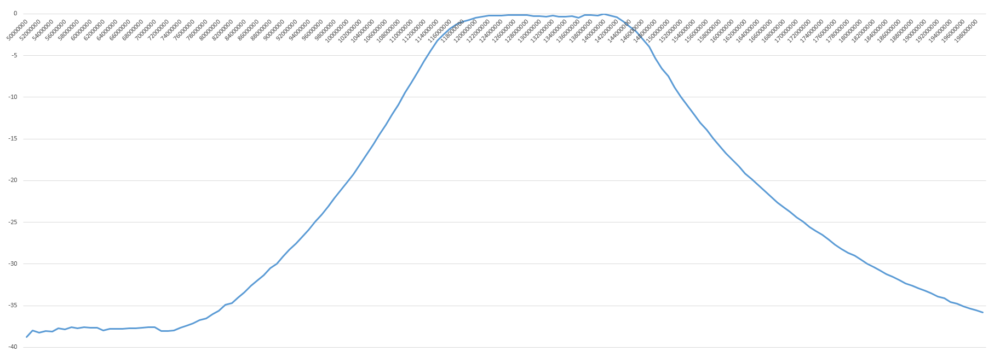

# 2m Band Pass Filter

## Characteristics

## BOM

 - 2x [1008 10nH](https://www.tme.eu/en/details/cw1008-10/smd-coils/ferrocore/)
 - 1x [1008 330nH](https://www.tme.eu/en/details/cw1008-330/smd-coils/ferrocore/)
 - 2x [0805 120pF](https://www.tme.eu/en/details/cc0805jrnpo9121/0805-mlcc-smd-capacitors/yageo/cc0805jrnpo9bn121/)
 - 1x [0805 3.6pF](https://www.tme.eu/en/details/cl21c3r6bbaannc/0805-mlcc-smd-capacitors/samsung/)
 - 2x [SMA](https://www.ebay.com/sch/i.html?_from=R40&_sacat=0&_nkw=sma+female+pcb+edge+mount&rt=nc&LH_BIN=1)

## License

[Apache License Version 2.0](./LICENSE)

## Donate

**LTC:** LWt34ZqNgCQPMJJFon7VX8Qbb1ejBHUcnR

**BTC:** 1YMKn8cp98mF7LPa3yndLKE1xQUYUqg8P
